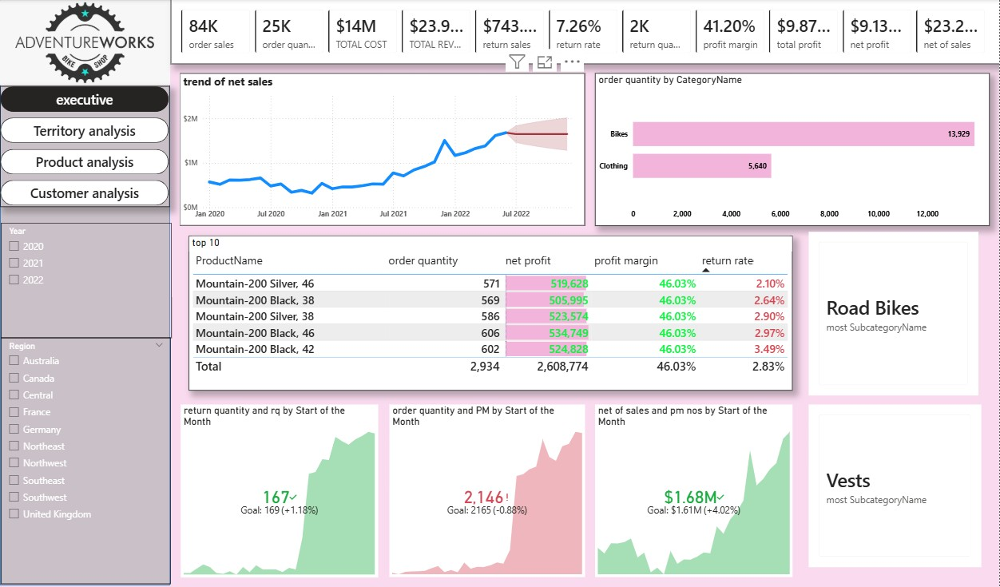
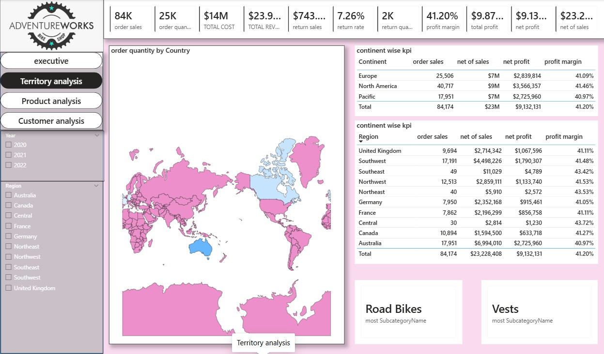
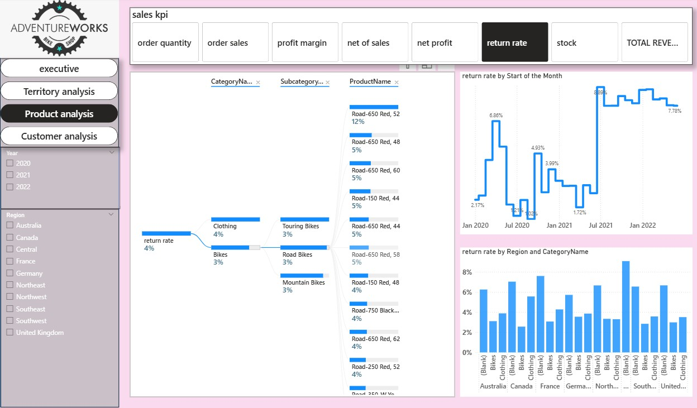
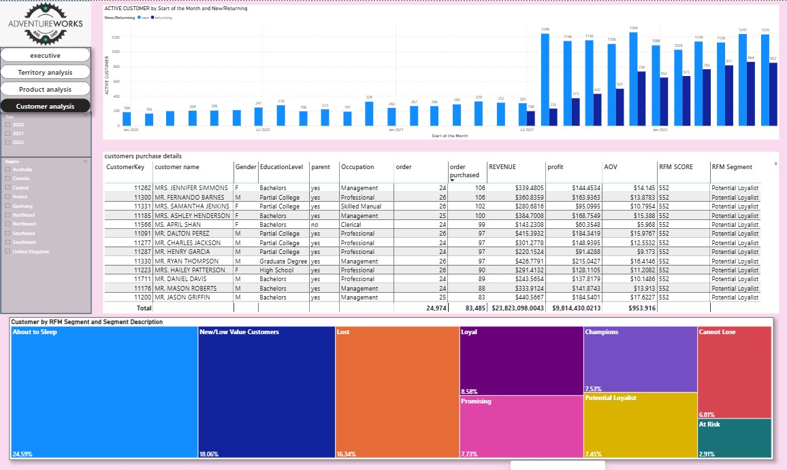

# Adventure-works
# AdventureWorks Sales Analytics Dashboard  - Project Overview

The AdventureWorks Sales Analytics Dashboard is a comprehensive end-to-end Business Intelligence project developed in Power BI to analyze sales performance, customer behavior, product performance, profitability, return trends, and regional insights using the AdventureWorks dataset.

This project was designed to transform raw transactional data into meaningful business insights through advanced data modeling, DAX calculations, interactive visualizations, AI-powered analytics, and customer segmentation techniques.

The dashboard provides a centralized analytical platform where users can monitor key business KPIs, evaluate sales growth, identify profitable products and regions, analyze customer purchasing behavior, and track return trends dynamically through interactive filtering and drill-through analysis.

The project contains multiple analytical pages including:

•	Executive Dashboard

•	Territory Analysis

•	Product Analysis

•	Customer Analysis

Each page was carefully designed with interactive slicers, KPI cards, advanced charts, and AI visuals to ensure professional storytelling and efficient business analysis.

# Project Objectives
The main objectives of this project are:

•	To monitor overall sales and profitability performance

•	To analyze product-wise and category-wise sales trends

•	To evaluate regional and country-level business performance

•	To identify customer purchasing behavior patterns

•	To measure return rates and product performance

•	To implement customer segmentation using RFM Analysis

•	To apply advanced DAX and Time Intelligence calculations

To create an interactive and user-friendly analytical dashboard
# Dashboards

# 1. Executive Dashboard
The Executive Dashboard provides a high-level summary of overall business performance using KPI indicators and trend analysis.
Included KPIs

•	Total Sales Revenue

•	Total Profit

•	Net Profit

•	Order Quantity

•	Return Quantity

•	Return Rate

•	Profit Margin

•	Net Sales

•	Total Cost

Executive Insights

•	Monthly sales trend analysis

•	Forecasting and trend visualization

•	Category-wise order quantity analysis

•	Top-performing products analysis

•	Profit margin evaluation

•	Return rate monitoring

•	Comparative KPI tracking

The dashboard dynamically updates using slicers for:

•	Year

•	Region

•	Country

This allows users to perform real-time business filtering and comparative analysis.
# Business Insights

# 1. Declining Sales Trend
•	Problem: From the trend of net sales, it’s clear that sales have fluctuated, with a declining trend observed in some periods. The sales volume drops are concerning, indicating a potential issue with product demand, sales strategies, or marketing effectiveness.

# Solution:

o	Actionable Insight: Evaluating the cause of the decline by looking at specific time periods. If the decline is seasonal, adjust inventory or promotional strategies to align with market demand. If the decline is unrelated to seasonality, consider reviewing marketing campaigns or sales strategies that may need optimization.

o	Data-Driven Solution: Using a time-series analysis to predict future sales trends more accurately, and adjust strategies in real time. Consider setting up automated alerts when sales fall below a specific threshold so that immediate action can be taken.

# 2. Low Return on Investment (ROI)
•	Problem: The profit margins in some areas seem to be low, especially on certain products like the Road Bikes. Some categories have been identified with net profits lower than expected, which could be a direct reflection of pricing strategy, high costs, or low product demand.

# Solution:

o	Actionable Insight: Evaluating the products or product categories with the lowest profit margins and assess whether there are issues with production cost, overheads, or pricing.

o	Cost Optimization: need to Look for opportunities to reduce costs or negotiate better supplier deals. Implement dynamic pricing strategies that respond to demand fluctuations.

o	Product Rationalization: If certain products consistently have low margins and high return rates, we need to consider removing them from the product line or offering discounts to clear stock, if they no longer align with the company’s goals.
# 3. Poor Return Rates
•	Problem: The return rate on several products is high (as shown in the return rate visual), which is detrimental to profitability. This suggests a disconnect between customer expectations and product quality or marketing promises.
# Solution:

o	Actionable Insight: Dive deeper into customer reviews and feedback to understand the reasons behind the high return rates. Is it due to poor product quality, misleading advertising, or incorrect customer expectations?

o	Customer Engagement: Strengthen post-purchase customer support and clearly communicate product features. Consider implementing a “no questions asked” return policy on certain high-risk items to build trust.

o	Supplier Collaboration: Work with suppliers to improve product quality or find cost-effective ways to reduce defect rates, thus lowering return rates.
# 4. Low Goal Completion
•	Problem: The “order quantity and PM by start of the month” widget shows that sales goals for some products, like the Vests, are underperforming. Only 23% of the target is met in some cases, which signals that these products are not moving as expected.
# Solution:

o	Actionable Insight: Reassess the marketing strategy for these underperforming products. Use targeted promotions, flash sales, or bundle offers to boost sales and meet these targets.

o	Stock Optimization: should Analyze the stock levels to ensure that there is enough inventory available for high-demand periods. For products with low demand, consider reducing stock or offering discounts to clear them out.

o	Product Placement: Adjust visibility for underperforming products, either on the website or through your advertising channels, to ensure that they reach the intended customer segment.
# 5. Sales Target Misses in Certain Regions
•	Problem: Some regions, like Central Europe and the UK, show inconsistent sales results compared to their sales targets. The regional sales performance seems to vary significantly.
# Solution:
o	Actionable Insight: Leverage geographic and customer segmentation data to tailor marketing efforts more regionally. Are customers in these regions responding to different sales pitches or products?

o	Targeted Regional Campaigns: Implement region-specific promotional campaigns, ensuring that the messaging and offers resonate with local preferences.

o	Sales Force Optimization: If sales performance is poor in specific areas, it may be necessary to look at local sales teams’ effectiveness, training, or incentive structures.

# 6. Potential Overstock of Low-Performing Products
•	Problem: Products like the Mountain Bikes are contributing disproportionately to the stock levels while the return rates seem manageable. This indicates that the stock may be sitting longer than expected, which ties up capital.
# Solution:
o	Actionable Insight: Review inventory turnover ratios and optimize supply chain management to reduce overstock. Excess stock ties up resources and risks being written off if not sold.

o	Dynamic Pricing: Introduce discount pricing or clearance sales for excess inventory to increase sales velocity. Integrating machine learning algorithms into the pricing strategy can help with the dynamic adjustment of prices based on demand and stock levels.

# 8. Data Inconsistencies in Product Performance
•	Problem: The performance data on some products is inconsistent. For example, certain products are showing low return rates and high sales, but not contributing to profit as expected.
# Solution:
o	Actionable Insight: Deepen the analysis by breaking down product performance by product variations, such as color, size, or model. Are certain configurations underperforming? Are there specific supply chain or delivery issues causing delays or dissatisfaction?

o	Advanced Segmentation: Apply clustering or segmentation analysis to categorize products based on their performance to identify and isolate the issues in underperforming product types or variants.

# 2. Territory Analysis
The Territory Analysis dashboard focuses on geographical sales performance and regional profitability.
Features Included

•	Global sales distribution map

•	Country-wise order quantity analysis

•	Continent-wise KPI comparison

•	Region-level profitability analysis

•	Profit margin comparison by region

•	Net sales and net profit evaluation

Analytical Insights

•	High-performing regions

•	Revenue-generating territories

•	Regional profit contribution

•	Geographic sales concentration

•	Continental performance comparison

The interactive map visualization improves geographic business understanding and decision-making efficiency.

# 3. Product Analysis Dashboard
The Product Analysis page focuses on product-level performance evaluation using advanced Power BI visualizations and AI-powered analytical tools.

Advanced Features Used

Decomposition Tree (AI Feature)

One of the major highlights of this project is the implementation of the Decomposition Tree AI Visual in Product Analysis.
This AI-powered feature allows dynamic drill-down analysis across:

•	Product Category

•	Subcategory

•	Product Name

•	Return Rate

•	Sales Performance

The decomposition tree enables users to identify hidden patterns and root-cause factors affecting business metrics interactively.
Product KPIs

The page analyzes:

•	Order Sales

•	Profit Margin

•	Net Profit

•	Net Sales

•	Return Rate

•	Revenue

•	Stock Analysis

Product Performance Insights

•	Top-performing products

•	High return-rate products

•	Best-selling categories

•	Subcategory contribution analysis

•	Product-level profitability comparison

•	Monthly return trend tracking

# 4. Customer Analysis Dashboard

The Customer Analysis page focuses on customer purchasing behavior and customer segmentation analytics.
 
RFM Segmentation Analysis

A major advanced analytical feature implemented in this project is RFM Segmentation.

RFM Meaning RFM stands for:

•	Recency → How recently a customer purchased

•	Frequency → How frequently the customer purchases

•	Monetary → How much revenue the customer generates
 
RFM Segmentation Measures
The project includes custom-built DAX measures for:

•	R Score

•	F Score

•	M Score

•	Combined RFM Score

•	Customer Segments Classification

Using these measures, customers were segmented into categories such as:

•	Champions

•	Loyal Customers

•	Potential Loyalists

•	New Customers

•	At Risk Customers

•	Lost Customers

•	Cannot Lose Them

•	About to Sleep
 
Customer Analysis Features
Included Metrics

•	Revenue by Customer

•	Profit by Customer

•	Average Order Value (AOV)

•	Customer Purchase Frequency

•	RFM Score

•	Customer Segment Classification

Visual Insights

•	Customer purchase behavior trends

•	Segment-wise customer distribution

•	High-value customer identification

•	Revenue contribution by segment

•	Loyalty pattern analysis

•	Customer retention behavior visualization

The use of Treemap Visualization effectively represents customer segment distribution visually and improves analytical storytelling.

# Data Analytics Techniques Used
This project demonstrates the application of several advanced Data Analytics and Business Intelligence techniques.

# 1. Data Cleaning & Transformation

Performed using Power Query Editor:

•	Data type correction

•	Null value handling

•	Column transformation

•	Data formatting

•	Relationship preparation

# 2. Data Modeling

Implemented professional star-schema-based relationships between:

•	Sales Table

•	Customer Table

•	Product Table

•	territory Table

•	Date Table

• category and subcategory table

This improved dashboard performance and analytical efficiency.

# 3. DAX Measures & Calculations
   
Extensive DAX measures were created for advanced KPI calculations.

DAX Measures Included

•	Total Revenue

•	Total Profit

•	Net Profit

•	Profit Margin %

•	Return Rate %

•	Total Orders

•	Order Quantity

•	Total Cost

•	Net Sales

•	AOV (Average Order Value)

•	RFM Scores

•	Dynamic KPI Measures

# 4. Time Intelligence Functions

Advanced Time Intelligence calculations were implemented using DAX functions.

Time Intelligence Features

•	month over month analysis

•	Year-wise analysis

•	Monthly trend analysis

•	Sales growth tracking

•	Time-based KPI comparison

•	Forecast trend visualization

These calculations helped create dynamic trend analysis visuals throughout the dashboard.

# 5. Interactive Dashboard Design

The project includes:

•	Dynamic slicers

•	Cross-filtering

•	Interactive visuals

•	Drill-down capability

•	Navigation between report pages

•	Responsive KPI cards

This improves user experience and analytical interaction.

# Professional Highlights of the Project
Advanced Analytical Capabilities

This project demonstrates strong practical skills in:

•	Business Intelligence

•	Data Visualization

•	Customer Analytics

•	Product Analytics

•	Geographic Analytics

•	DAX Programming

•	AI-based Visualization

•	KPI Engineering

•	Data Storytelling

# Technical Skills Demonstrated

Power BI Skills

•	Power Query

•	Data Modeling

•	Relationship Management

•	DAX Measures

•	Time Intelligence

•	KPI Development

•	Dashboard Design

•	Interactive Reporting

•	AI Visual Implementation

